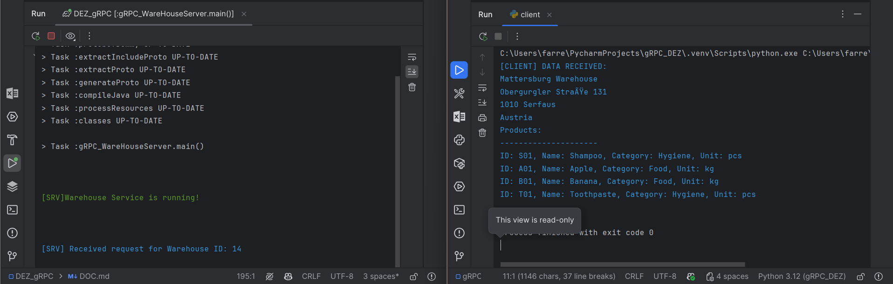

# DOCUMENTATION "gRPC"
## Patrick Farrenkopf
## 11.11.2025


---


### Questions
1. **What is gRPC and why does it work across languages and platforms?** \
   gRPC is a high-performance, open-source Remote Procedure Call framework developed by Google. It works across languages and platforms because it uses Protocol Buffers for data serialization and provides language-specific code generation, allowing communication between services written in different programming languages on various platforms.

2. **Describe the RPC life cycle starting with the RPC client.** \
   The RPC life cycle begins when the RPC client makes a request to call a remote procedure. The client stub serializes the request parameters and sends them to the server. The server stub receives the request, deserializes the data, and invokes the actual procedure on the server. The server then processes the request, sends the response back through the stub, and the client stub deserializes the response before returning it to the client application.

3. **Describe the workflow of Protocol Buffers.** \
   The workflow of Protocol Buffers starts with defining the data structure in a .proto file. This file is then compiled using the Protocol Buffer compiler (protoc) to generate code in the desired programming language. The generated code is used in applications to serialize structured data into binary format for transmission and to deserialize binary data back into usable objects.

4. **What are the benefits of using Protocol Buffers?** \
   The benefits of using Protocol Buffers include efficient serialization with smaller message sizes, faster parsing compared to text formats like JSON or XML, strong data structure definition, backward and forward compatibility, and support for multiple programming languages.

5. **When is the use of Protocol Buffers not recommended?** \
   The use of Protocol Buffers is not recommended when human readability of data is important, when frequent schema changes occur without control, or when working in systems that primarily rely on text-based formats like JSON for interoperability.

6. **List 3 different data types that can be used with Protocol Buffers.** \
   Three different data types that can be used with Protocol Buffers are int32, string, and bool.

---

### Hello, gRPC!

A simple gRPC service has been given, containing following files:
- `hello.proto`: The Protocol Buffers definition file for the gRPC service.
- `HelloWorldServer`: The server implementation of the gRPC service.
- `HelloWorldClient`: The client implementation that communicates with the gRPC server.
- `HelloWorldServiceImpl`: The implementation of the service defined in the `hello.proto` file.

Following files give a simplified environment and 2 Services: Server and Client. the Servers code
was straightforward, as visible below:
    
```java
import io.grpc.Server;
import io.grpc.ServerBuilder;

import java.io.IOException;

public class HelloWorldServer {

    private static final int PORT = 50051;
    private Server server;

    public void start() throws IOException {
        server = ServerBuilder.forPort(PORT)
                .addService(new HelloWorldServiceImpl())
                .build()
                .start();
    }

    public void blockUntilShutdown() throws InterruptedException {
       //blocking management...
    }

    public static void main(String[] args) throws InterruptedException, IOException {
        // server start-methods
        server.start();
        server.blockUntilShutdown();
    }
}
```
The Server in short only represnts the "Server"-Object, as all its methods load into it.

The Client code required more time to understand, as it was needed to research on used packages.
```java
import io.grpc.ManagedChannel;
import io.grpc.ManagedChannelBuilder;

public class HelloWorldClient {

    public static void main(String[] args) {

        String firstname = args.length > 0 ? args[0] : "Max";
        String lastname  = args.length > 1 ? args[1] : "Mustermann";

        ManagedChannel channel = ManagedChannelBuilder.forAddress("localhost", 50051)
                .usePlaintext()
                .build();

        HelloWorldServiceGrpc.HelloWorldServiceBlockingStub stub = HelloWorldServiceGrpc.newBlockingStub(channel);

        Hello.HelloResponse helloResponse = stub.hello(Hello.HelloRequest.newBuilder()
                .setFirstname(firstname)
                .setLastname(lastname)
                .build());
        System.out.println( helloResponse.getText() );
        channel.shutdown();

    }

}
```
it first receives the data given within the parameter, and then builds a channel to the server.
After that, it creates a blocking stub to call the remote procedure defined in the proto file.
Finally, it constructs a request message, sends it to the server, receives the response, and prints the result.

### integrating gRPC into a given Service

In this chapter the before used warehouse service has been rewoked to work with gRPC.
Implementation was especially simple, since the structure has been copied over from the previous example.
Only the proto file will be mentioned, as it represents the only difference to the "hello" example.

Working on this example has helped to further understand the structure of the proto file.
```proto
service WarehouseConnector {
  rpc data(WarehouseRequest) returns (WarehouseResponse) {}

}

message WarehouseRequest {
  int32 warehouseID = 1;
}

message Product {
  string productID = 1;
  string productName = 2;
  string productCategory = 3;
  string productUnit = 4;
}

message WarehouseResponse {
  int32 warehouseID = 1;
  string warehouseName = 2;
  string warehouseAddress = 3;
  string warehouseCountry = 4;
  string warehouseCity = 5;
  string warehousePostalcode = 6;
  string timestamp = 7;
  repeated Product products = 8;
}
```
### Python Client in gRPC
to demonstrate one of gRPCs advantages, cross-language compatibility, a python client has been implemented.
By importing the protoc compiler and the by google delivered grcp libraries, there was no 
difference to the java environment except for the language.
```python
pip install grpcio 
pip install grpcio grpcio-tools
```
By running the following command, we receive the required python files to work with gRPC.
(Stub,Request & response)
```bash
python -m grpc_tools.protoc -I. --python_out=. --grpc_python_out=. example.proto   
```
The code of the python client is structured the same as java client, differing only in the amount of boilerplate code:
```python
import grpc
import warehouse_pb2
import warehouse_pb2_grpc

def main():
    # Create a channel to connect to the gRPC server
    channel = grpc.insecure_channel('localhost:50051')

    # Create a stub (client) to interact with the server
    stub = warehouse_pb2_grpc.WarehouseConnectorStub(channel)

    # Create a request message
    request = warehouse_pb2.WarehouseRequest(warehouseID=14)

    # Call the remote procedure and get the response
    response = stub.data(request)

    # Build the output string
    sb = f"{response.warehouseName}\n" \
         f"{response.warehouseAddress}\n" \
         f"{response.warehousePostalcode} {response.warehouseCity}\n" \
         f"{response.warehouseCountry}\n" \
         f"Products:\n" \
         f"---------------------\n"

    for product in response.products:
        sb += f"ID: {product.productID}, Name: {product.productName}, " \
              f"Category: {product.productCategory}, Unit: {product.productUnit}\n"

    # Print the received data
    print(f"\033[34m[CLIENT] DATA RECEIVED:\n{sb}\033[0m")

    # Close the channel
    channel.close()

if __name__ == "__main__":
    main()
```
When the server(java) is running, the client(python) can be successully executed.
